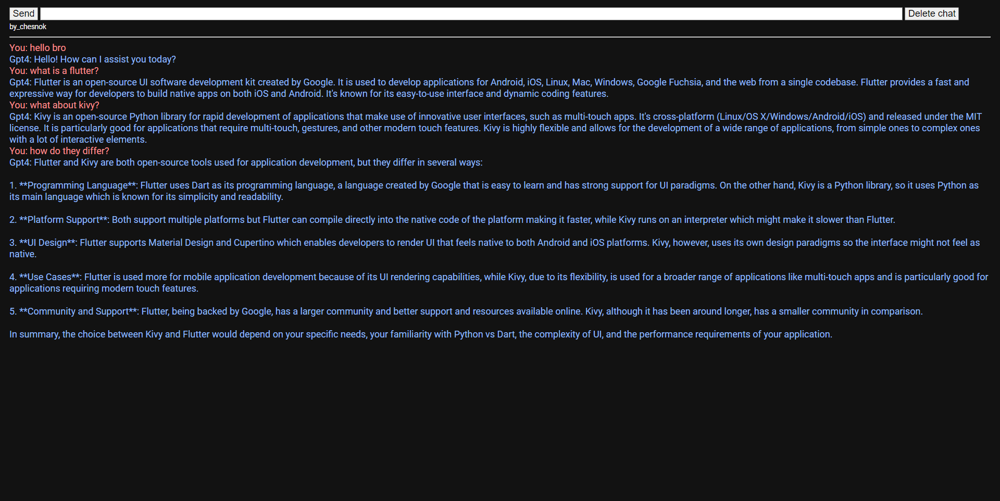
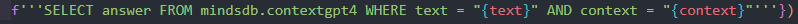
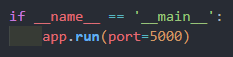

## simple chat for gpt4 free 
work on free gpt4 mindsdb version \


see demo https://simplechatforgpt4--chesnokpeter.repl.co/

### Features
 - **completely free**
 - context support
 - saving the dialog on page reload

### Install
If you have problems with the installation, you can write to me,   tg:@chesnokpeter

#### Prerequisites
[Download and install Python](https://www.python.org/downloads/) (Version 3.x is recommended).
#### Setting up the project
1. Download or clone this GitHub repo
    ```
    git clone https://github.com/chesnokpeter/SimpleChatForGPT4.git
    cd SimpleChatForGPT4
    ```

2. Sign up: https://mindsdb.com/ \
    Your plan: demo \
    Log into the database \
    We make a request:
    ```
    CREATE MODEL mindsdb.contextgpt4
    PREDICT answer
    USING
        engine = 'openai',
        max_tokens = 1000,
        model_name = 'gpt-4',
        temperature = 0.8,
        prompt_template = '{{text}}
        Context: {{context}}';
    ```
    RUN this request

3. Open the `config.json` file in the repository on your machine and fill in the boxes
    ```
    {
        "mindsdb_login" : "",
        "mindsdb_password": ""
    }
    ```
    
    | Key           | Description                           |
    |:-------------:|:-------------------------------------:|
    |**login**      |Your login from the previous step      |
    |**password**   |your password from the previous step   |

4. Install the required Python packages from `requirements.txt`
    ```
    pip install -r requirements.txt
    ```

5. If required, install the following items
     - sql query to database mindsdb \
         
     - server port \
        
6. To run, enter `python server.py` and go to http://localhost:5000/

### Legal notice
This project is for **educational purposes only**. It is simply a small personal project.

Please note the following:
 - Liability: Users are solely responsible for their actions and any consequences that may ensue. 

 - For educational purposes only: This repository and its contents are provided strictly for educational purposes.

 - Indemnification: Users agree to indemnify, defend and hold the author of this repository harmless from any claim, liability, damage, loss or expense, including legal fees, arising from or in any way connected with the use or misuse of this repository, its contents.

 - Updates and Changes: The author reserves the right to change, update or delete any content, information or functions in this repository at any time without prior notice. Users are responsible for regularly reviewing the content and any changes made to this repository.

By using this repository or any code associated with it, you agree to these terms. The author is not responsible for any copies, forks or re-downloads made by other users.